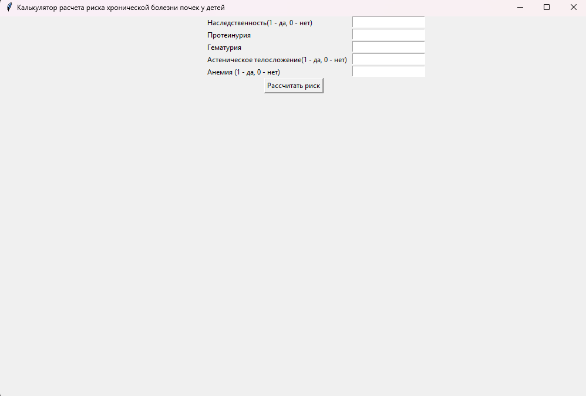
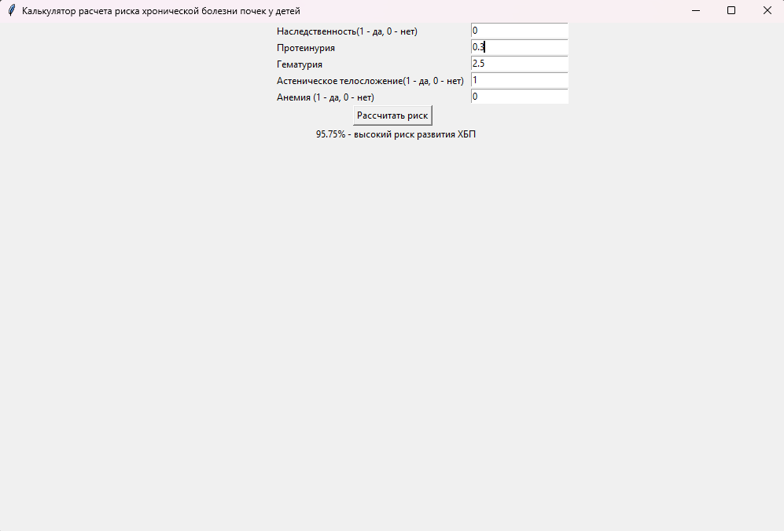
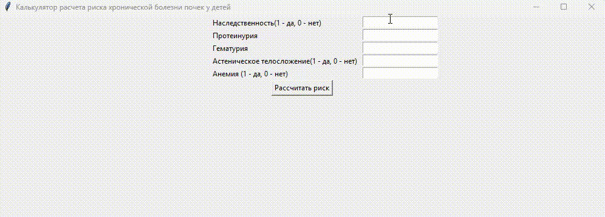

# Калькулятор расчета риска хронической болезни почек у детей (Свидетельство о государственной регистрации программы для ЭВМ № 2024685217)

Инструмент для врачей-нефрологов, основанный на модели «Дерево решений» и правилах экспертной системы.  
Приложение помогает оценить вероятность развития ХБП на основе клинических показателей и генетических маркеров.

⚠ Код закрыт, поскольку содержит оригинальные алгоритмы и медицинские методики, не предназначенные для публичного распространения.  
Для портфолио доступна демонстрационная сборка и визуальные материалы.

---

## 🚀 Возможности
- ввод клинических параметров (протеинурия, гематурия, IL4 T598T);
- принятие решения на основе встроенной модели дерева решений;
- мгновённая оценка риска развития ХБП;
- простой и удобный графический интерфейс (Tkinter);
- готовая Windows-сборка (.exe) для запуска без Python.

---

## 📸 Скриншоты
| Интерфейс |
|----------|
|  |

| Пример результата с низким риском|
|-------------------|
|  |

| Пример результата с высоким риском|
|-------------------|
|  |
---

## 🎥 Видео-демо работы программы

---

## 📦 Скачать сборку
Скачать EXE-файл можно из раздела **Releases**.

[👉 Перейти к releases](../../releases)

---

## 🔧 Технологии
- Python  
- Tkinter  
- Decision Tree logic (custom)  

---

## ℹ Почему код закрыт?
Проект создавался совместно с врачами и исследовательской группой.  
Алгоритмы оценки риска включают собственные правила и последовательности решений, не подлежащие открытой публикации.

В репозитории представлены:
- интерфейс и визуальная часть (через скриншоты и видео),
- исполняемая сборка для демонстрации работы.

---

## 🧑‍💻 Автор
Кокин Александр — Python Developer  
@Yaporii - telegram, Kokin.Alexander1@yandex.ru - email
